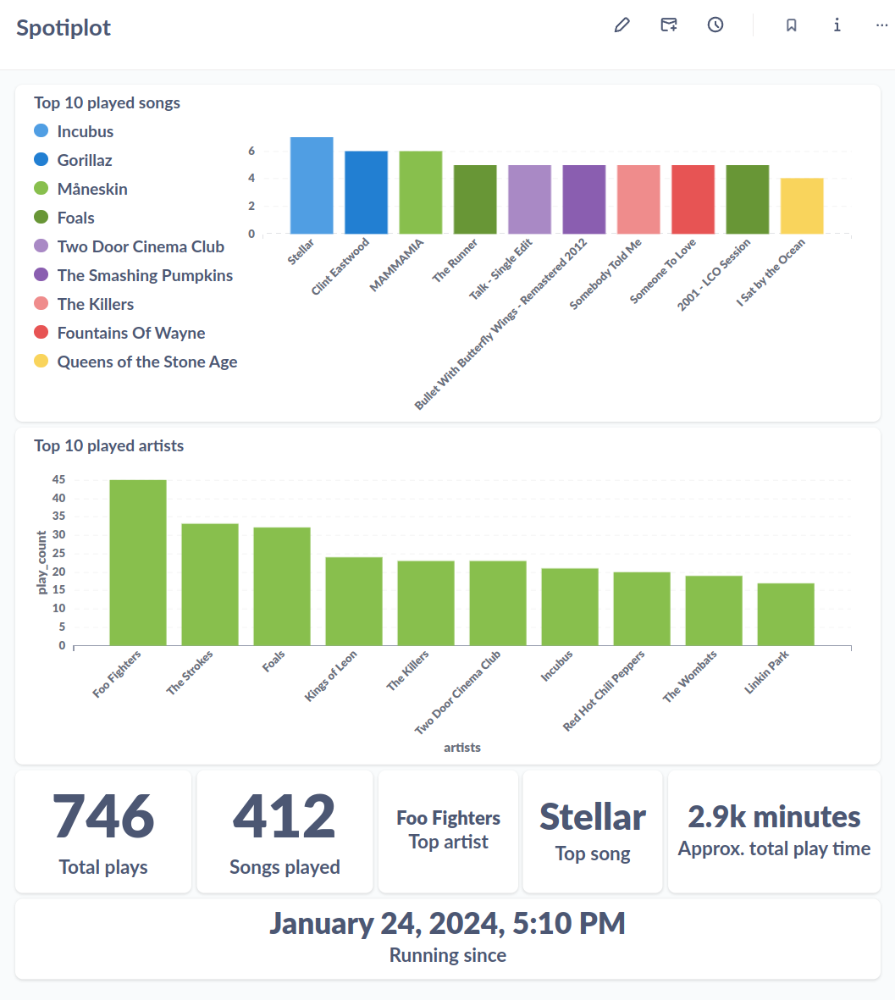

# Spotiplot

A project for data analysis of Spotify usage, completely built with Docker.

## Introduction

The project integrates:

- Python, to make requests to the [Spotify API](https://developer.spotify.com/documentation/web-api) through [Spotipy](https://spotipy.readthedocs.io/)
- MySQL, to store the data collected.
- Metabase, to visualize the data and create dashboards.
- Adminer, a tool for database debugging.

Here is an example of a possible dashboard:


## Requirements

A machine running Docker and Docker compose, which can run constantly. This can be either an online instance or a local machine (e.g., Raspberry Pi)

**Note:** Metabase requires the architecture `amd64`. It is possible to run the back-end services (Spotify monitor, MySQL database) in a `armv8` unit (e.g., Raspberry Pi 3), and then run Metabase in a separate `amd64` machine.

## Handling MySQL passwords

Before running this code, create a file named`.env` , and update `MYSQL_PASSWORD` and `MYSQL_ROOT_PASSWORD` passwords as you prefer. A default file named `default.env` is included in the project, and can be used as a reference:

```yaml
MYSQL_PASSWORD: sample_password
MYSQL_ROOT_PASSWORD: sample_root_password
```

## Handling Spotify credentials

To use Spotiplot, it is necessary to create an application on your [Spotify Developer Dashboard](https://developer.spotify.com/dashboard). You can create your own app name, description and website. Set the Redirect URI to `'http://0.0.0.0:8083'`, as it is the value expected by the Docker container. If this is set to a different value, modify the docker compose and the authenticator script accordingly.

It will also be necessary to create a file to store the Spotify credentials: `app/spotiplot.env`. The file should be populated with the information available on your personal developer dashboard. A default file named `default_spotiplot.env` is included in the project (inside the `app` folder), and can be used as a reference:

```yaml
credentials:
    client_id: '<client_id>' 
    client_secret: '<client_secret>' 
    redirect_uri: 'http://0.0.0.0:8083'
```

## Building the Docker Image

The docker image for the spotiplot monitor contains two scripts:

- One for authenticating with Spotify, generating the access tokens and storing them as cache inside the container.
- One for monitoring the songs that are played.

The image should be built and executed before the docker compose. This will allow the authentication procedure, which requires user input, to retrieve the necessary tokens.

```sh
cd <path_to_spotiplot>
docker build -t spotiplot_monitor app/.
docker run -it -p 8083:8083 -v $(pwd)/app/cache:/app/cache spotiplot_monitor
```

When the image is executed, it will provide an URL that should be copied into a browser. Authenticate with Spotify on this browser session, and then copy the resulting URL back into the docker container. This will store the necessary tokens.

Once the tokens are saved, it is possible to start the system through the command:

```sh
docker compose up
```

## Visualizing the data with Metabase

[Metabase](https://www.metabase.com/) is a powerful and user-friendly tool to generate graphs based on data stored in a database. On top of that, it is easily integrated into this project's docker architecture.

Through Metabase, it is possible to create several SQL queries, and combine their results in a dashboard. This dashboard will then automatically update when the data inside the database is updated.

On its free tier, Metabase does not support [Serialization](https://www.metabase.com/docs/latest/installation-and-operation/serialization), so it is not possible to share dashboards. Users are then invited to create and customize their own dashboard as they prefer.

It is possible to run Metabase along with the monitor and the database in a server, and it is also possible to run it locally in your machine while connecting to the monitor and database containers running in a different machine.

### Configuring Metabase

First, ensure that you have the monitor and database containers running:

```sh
cd spotiplot
docker compose up
```

Once this is done, start the Metabase container (from Metabase [Dockerhub](https://hub.docker.com/r/metabase/metabase/tags)):

```sh
docker run -p 3000:3000 --name spotiplot_metabase metabase/metabase
```

Then, proceed to the [local Metabase page](http://0.0.0.0:3000) and perform the following:

- Choose your preferred language
- Create your credentials (it is not necessary to insert personal data). Note down the e-mail/password combination for future logins.
- Configure your connection to the database:
  - Select MySQL as your database
  - Create your own display name  (e.g. Spotiplot)
  - Enter the IP address of the machine running the other containers (if locally enter 0.0.0.0)
  - Enter the MySQL port (default: 3306)
  - Enter `spotiplot` as the database name
  - Enter `spotiplot` as the username
  - Enter the mysql credential as defined in your .env file
  - Finish your setup about data collection and the Metabase newsletter as you want (all this is performed by Metabase, Spotiplot does not store any of your data).
  - Select "Take me to Metabase"

### Creating your dashboard

Once in Metabase's main panel, it is possible to perform SQL queries and plot their results, and also create dashboard to aggregate multiple queries. All of this is done through the blue `+ New` button on the top-right corner.

Metabase provides a rich [getting started](https://www.metabase.com/learn/getting-started/introduction) page with instructions on how to work with your data.

In short, first create a dashboard, and then create multiple SQL queries based on the data that you want to analyse. When saving the query, select your dashboard to have it linked automatically. Finally, proceed to the dashboard to customize it's layout as preferred.

Some of the queries used for this dashboard can be found in the metabase [folder](./metabase)

### Commiting your changes

After the initial setup, it is interesting to commit your working container to resume its operation from there instead of starting from scratch. To do so, it is necessary to create a new image based on the current state of your container:

First, get the id of your running container:

```sh
docker container ls
```

Then, commit your changes to a new image:

```sh
docker commit <container_id> metabase_spotiplot
```

Now, docker will have an image saved with the name `metabase_spotiplot`. Check with the following command:

```sh
docker image ls
```

### Running as a standalone component

To start a container based on the committed Metabase image, simply run:

```sh
docker run -d -p 3000:3000 spotiplot_metabase
```

Ensure that your container will have access to the database to have everything working smoothly.

### Integration with docker compose

It is possible to integrate the metabase container into the docker compose, depending on the use case. For example, if running on an online server, this would allow your metabase instance to be accessible from anywhere through its public IP.

To achieve this, simply add the Metabase service by copying the lines below to the list of services inside docker-compose.yaml:

```yaml
  metabase:
    image: spotiplot_metabase
    ports:
    - 3000:3000
    networks:
      - spotiplot-network
```

## Visualizing the data with Adminer

Adminer is included into the docker compose image to enable visualization of the content stored into the database (for debug purposes).

To log into Adminer:

- Make sure the docker compose environment is up.
- Go to the [adminer login page](http://<host_ip>:9090)
- Set server name to the MySQL service name `mysql`
- Set username to spotiplot
- Enter the password defined into the `MYSQL_PASSWORD` variable
